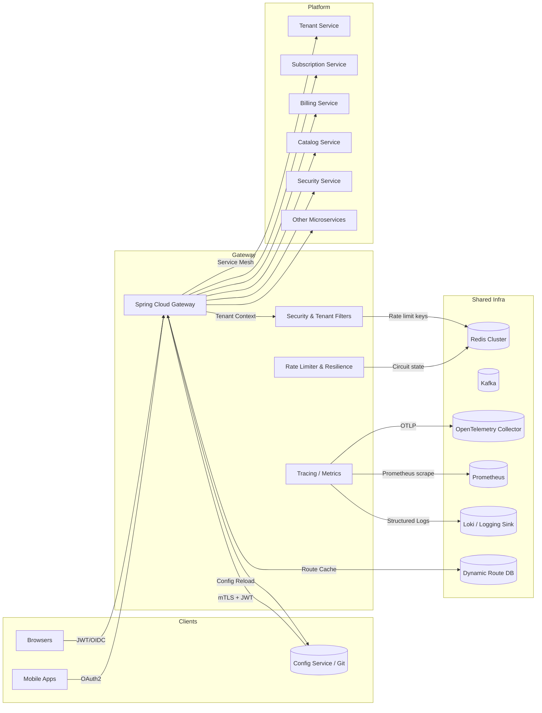

# API Gateway Enhancement Plan

This document describes the incremental steps required to harden, scale, and operationalize the Ejada SaaS Products Framework API Gateway. The plan assumes a Spring Boot 3.5.x / Spring Cloud Gateway 2024.x stack running on Kubernetes (GKE) and reuses the shared framework starters (security, observability, core, redis, kafka).

> **Goal**: deliver a production-grade edge service with security, resilience, observability, and dynamic multi-tenant routing baked in.

---
## 1. Architecture Overview



---
## 2. Security Hardening

### 2.1 JWT & OIDC Strategy
1. **Rotate to asymmetric signing** – configure shared security starter to prefer RS256/ES256 keys sourced from the IdP JWK set.
2. **Support multiple issuers** – load trusted issuers (internal IAM + external partners) through configuration; fallback to OIDC discovery when a token issuer is unknown.
3. **Tenant-aware claims** – map `tenant_id`, `sub`, `scope`, and custom framework roles into the `Authentication` object via a custom converter.
4. **mTLS for partner channels** – optionally enforce client certificates for partner route groups.

#### Key Snippet – `GatewaySecurityConfiguration`
```java
@Bean
ReactiveJwtDecoder reactiveJwtDecoder(SharedSecurityProps props,
                                      ObjectProvider<ReactiveClientRegistrationRepository> clients) {
    return new DelegatingReactiveJwtDecoderFactory(props, clients).create();
}
```

### 2.2 Edge Policies
- Centralize CORS in a whitelist driven by configuration (`shared.security.resource-server.allowed-origins`).
- CSRF disabled for stateless APIs but allow enabling per profile.
- Introduce `TenantAuthorizationManager` to enforce tenant isolation before proxying downstream.
- Provide `/actuator/tenants` endpoint for operational introspection (secured for ops).

---
## 3. Resilience & Graceful Degradation

### 3.1 Route-level Controls
- Each route defines `circuitBreaker`, `retry`, and `bulkhead` policies via `gateway.routes.*` configuration.
- Support runtime overrides through Spring Cloud Config / ConfigMap reload with `GatewayRouteRefresher`.
- Provide default fallback URIs that render `BaseResponse` envelopes (`FallbackController`).

#### Snippet – Configuring Backoff
```yaml
gateway:
  defaults:
    resilience:
      retry:
        backoff:
          first-backoff: 100ms
          max-backoff: 5s
          factor: 1.5
          jitter: true
```

### 3.2 Graceful Degradation Patterns
- Static fallback responses for read-only APIs.
- Kafka-backed command queue for write operations (return `202 Accepted`).
- Serve cached tenant metadata from Redis when downstream is slow.

---
## 4. Scalability & Performance

### 4.1 Reactive Redis Rate Limiting
- Enable `shared.ratelimit.enabled=true` with strategies `tenant`, `user`, `ip`.
- Configure per-tenant overrides via `RateLimitProps`. Metrics emitted for `429` counts.

### 4.2 Connection & Thread Tuning
- Configure Netty connection pools (`spring.cloud.gateway.httpclient.pool.*`).
- Use `reactor.netty.ioWorkerCount` aligned with CPU limits (2 x vCPU).
- Expose `requests.active` metric for autoscaling triggers.

### 4.3 Zero-downtime Configuration Reloads
- Mount ConfigMap as volume, watch with Spring Cloud Kubernetes reload, trigger `RefreshRoutesEvent` to rebuild route cache without restart.

---
## 5. Observability

### 5.1 Tracing & Correlation
- Use `ContextManager` filter to put `traceId`, `spanId`, `tenantId`, and `correlationId` into MDC.
- Configure OpenTelemetry exporter via OTLP gRPC to collector.

### 5.2 Metrics & Health
- Per-route timers (`gateway.requests`, `gateway.latency`) and error gauges.
- Add `/actuator/gateway/routes` exposure and synthetic SLA checks.
- Structured JSON logging via Logback encoder.

---
## 6. Enterprise Features

### 6.1 Dynamic Routing
- Provide `GatewayRouteDefinitionProvider` SPI (database, feature flag service, partner onboarding portal).
- Cache results in Redis / Caffeine and refresh on config change events.

### 6.2 API Versioning & Validation
- Enforce version header or URI prefix via predicate filters.
- Validate request schema for critical endpoints using `SchemaValidationFilter` (JSON Schema / OpenAPI).

### 6.3 Blue/Green & Canary
- Weighted route support with metadata `weight` and header-based routing for targeted tenants.
- Integrate with service mesh (Istio / ASM) for traffic splitting.

---
## 7. DevOps & Delivery

### 7.1 Container & Runtime
- Multi-stage build (Maven + JRE 21 distroless-alpine).
- Expose `HEALTHCHECK CMD wget -qO- localhost:8080/actuator/health`.

### 7.2 Helm Chart Enhancements
- Configure HPA based on CPU & custom metric `gateway.requests.active`.
- Add PodDisruptionBudget, PodSecurityContext, and Secret mounts for TLS keys.

### 7.3 Testing Strategy
- WireMock-backed contract tests for downstream services.
- Resilience integration tests using Testcontainers (Redis, mock services).
- Gatling/Locust performance scripts (SLO validation).

---
## 8. Implementation Roadmap

1. **Foundation (Week 1)**
   - Update configuration (`application.yaml`) & Dockerfile.
   - Implement enhanced security & context filters.
   - Introduce dynamic route SPI and refresher.

2. **Resilience & Observability (Week 2)**
   - Fine-tune Resilience4j settings per route.
   - Publish Prometheus dashboards and OTEL collector config.
   - Add fallback envelopes & integration tests.

3. **Enterprise Capabilities (Week 3)**
   - Build dynamic route admin UI / API.
   - Add blue/green + canary toggles.
   - Harden Helm chart with HPA, PDB, PSP equivalents.

4. **Operational Excellence (Week 4)**
   - Performance & chaos testing.
   - Document runbooks, alert thresholds, escalation policies.
   - Final security audit (pen-test findings closure).

---
## 9. References
- Spring Cloud Gateway Best Practices
- Resilience4j documentation
- OpenTelemetry & Spring Observability
- Google Cloud GKE production hardening guide

